>[!Warning]
>Important Note on LiPo Battery Safety & Handling
> 
>Lithium Polymer (LiPo) batteries are required for this keyboard but are sensitive and pose a **potential fire hazard** if damaged or improperly handled.
> 
>Due to strict international shipping regulations, **LiPo batteries are not included** with your keyboard kit and must be purchased separately.
> 
>### Your Responsibilities as the Builder
>* **Source Safely:** Obtain your LiPo battery from a reputable supplier.
>* **Handle with Care:** Always adhere to the safety, charging, and usage instructions provided by the battery manufacturer.
> 
>### 📜 Liability Acknowledgment
>By using a LiPo battery with this product, you acknowledge and accept all risk. I cannot be held responsible for any damage, injury, or loss resulting from the selection, use, charging, or installation of the battery.
> 
>Please proceed with caution and follow all safety guidelines.
> 
>

## 🔋 Battery Installation

Battery installation basically requires you to unscrew the battery compartment under each half, place the battery in the slot, put the JST connector through the hole so it comes out next to the MCU, screw the battery compartment back in place, then plug the JST connector into its socket.

1. **Unplug the OLED**  
   - Remove the acrylic OLED cover and carefully pull it out of its socket.  
   - 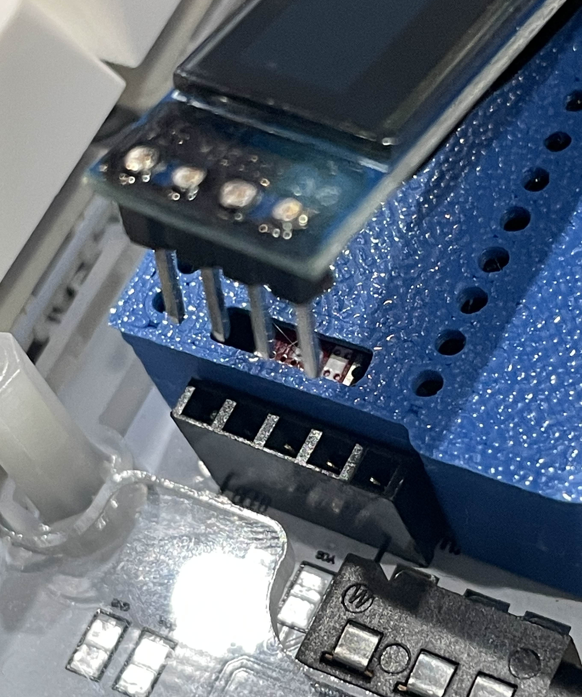  

2. **Remove MCU Cover**  
   - Start by pulling it over the USB-C port so it is easier to remove.  
   - 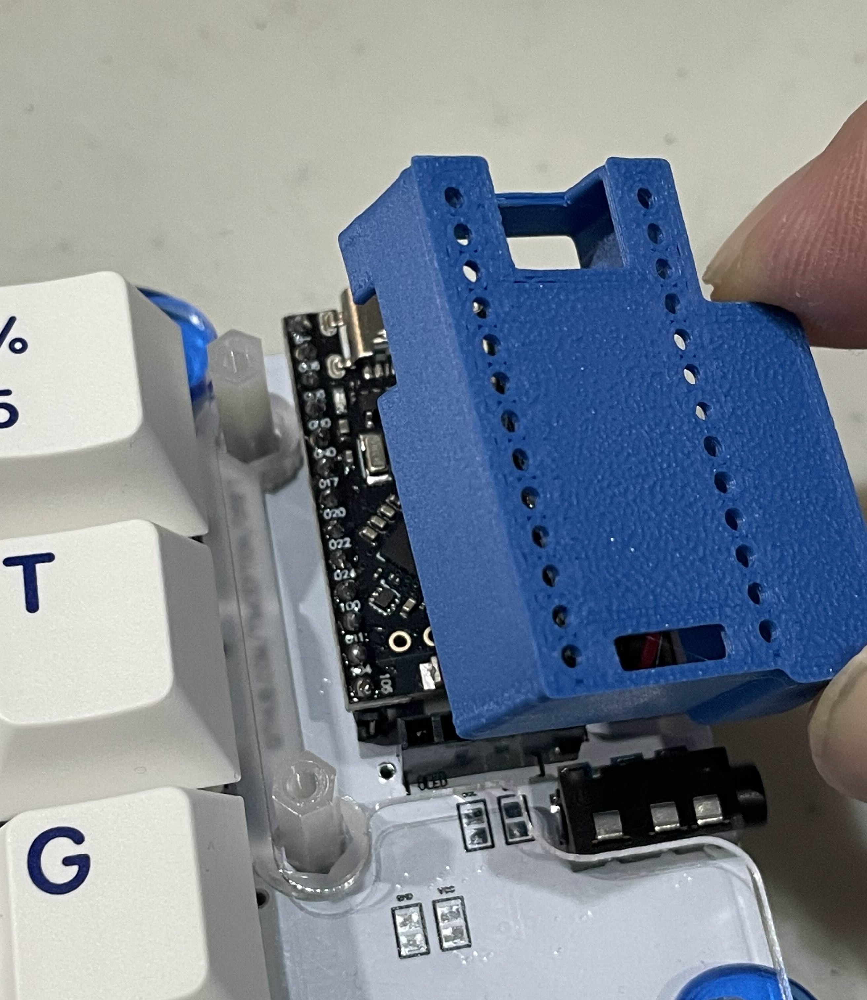  

3. **Remove 12mm Screw**  
   - This is one of the longer screws.  
   - 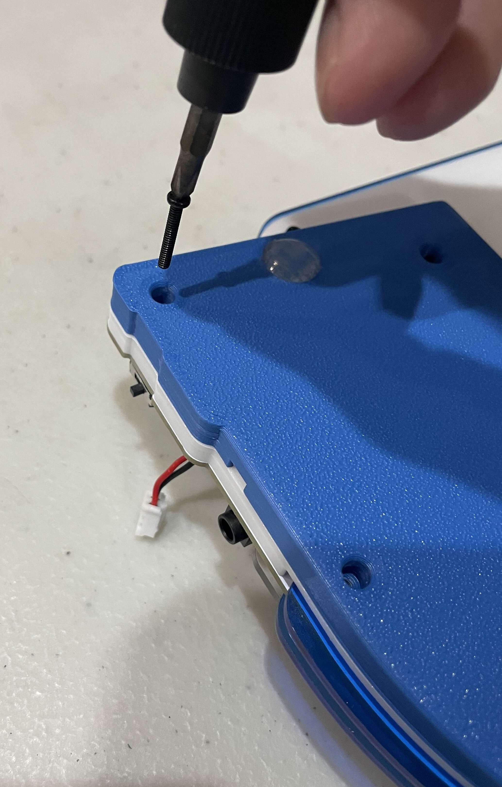  

4. **Remove Remaining Shorter Screws**  
   - Keep note on which screws are 4mm and 5mm.  
   - 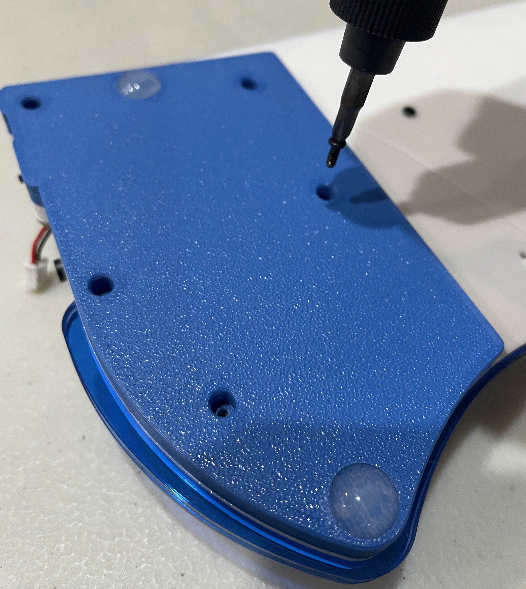  

5. **Place Battery into Slot**  
   - Pay attention to where the battery wire comes out. The battery should sit flat in the compartment.  
   - 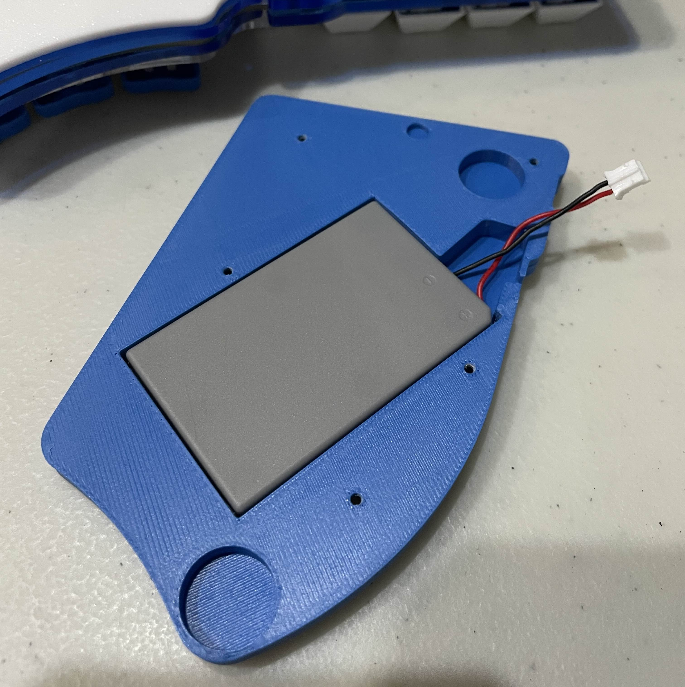  

6. **Put JST Connector through Hole**  
   - Carefully feed the JST connector and wire through the hole next to the MCU location.  
   - Make sure the wire is not pinched or folded in a dangerous manner.  
   - 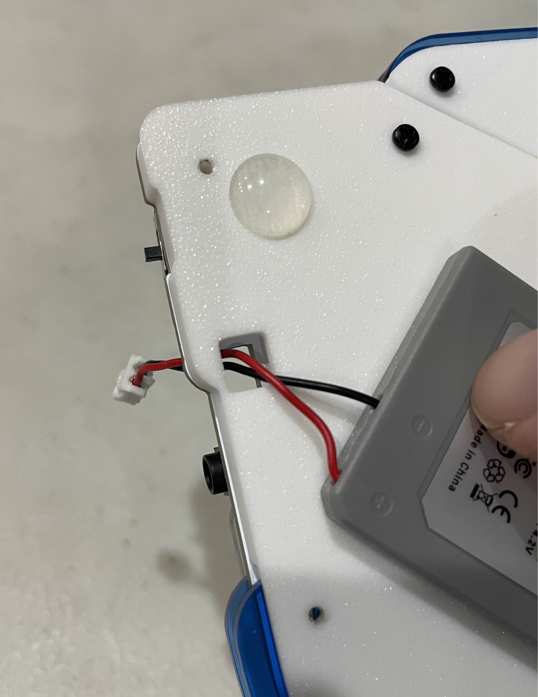  

7. **Put all the Screws back in place**  
   - Again, make sure the shorter and longer screws into their respective positions.  
   - 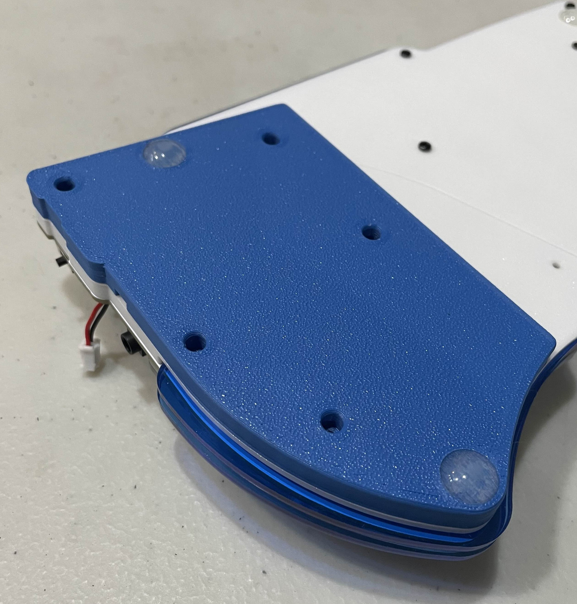  

8. **Insert JST Connector Correctly**  
   - The JST jumpers should already be set correctly, if unsure please look at 11 and 12.  
   - The Playstation 3 Controller battery wire is usually black (-) on the left and red (+) on the right when plugged in.  
   - 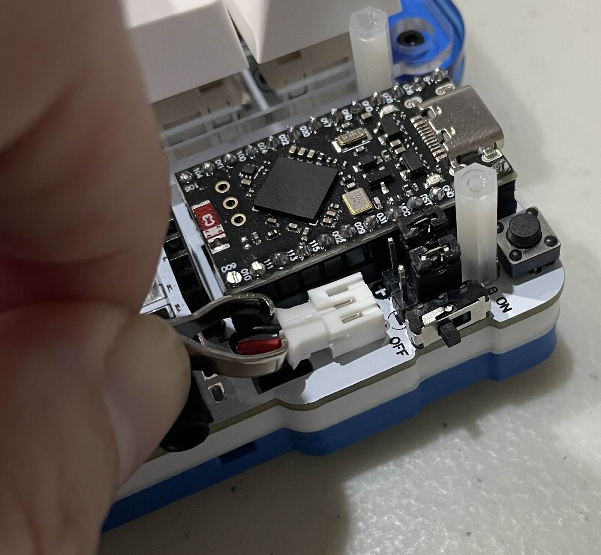  

9. **Put MCU Cover back on**  
   - Make sure the cover sits correctly and does not block the USB-C socket.  
   - 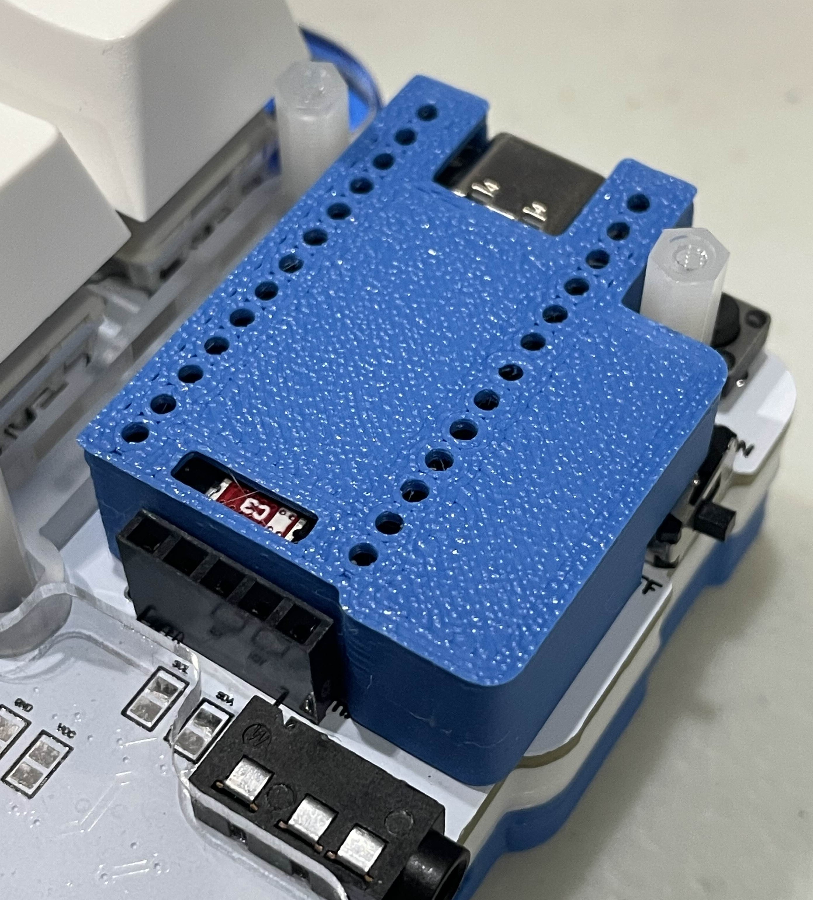  

10. **Correctly Plug OLED back in**  
   - For standard 4-Pin OLEDS, the four left pin sockets are used.  
   - The 5th pin is for the Nice!View screen and requires different firmware.  
   - Since there is a dongle you can remove the OLEDs altogether to increase battery life!  
   - 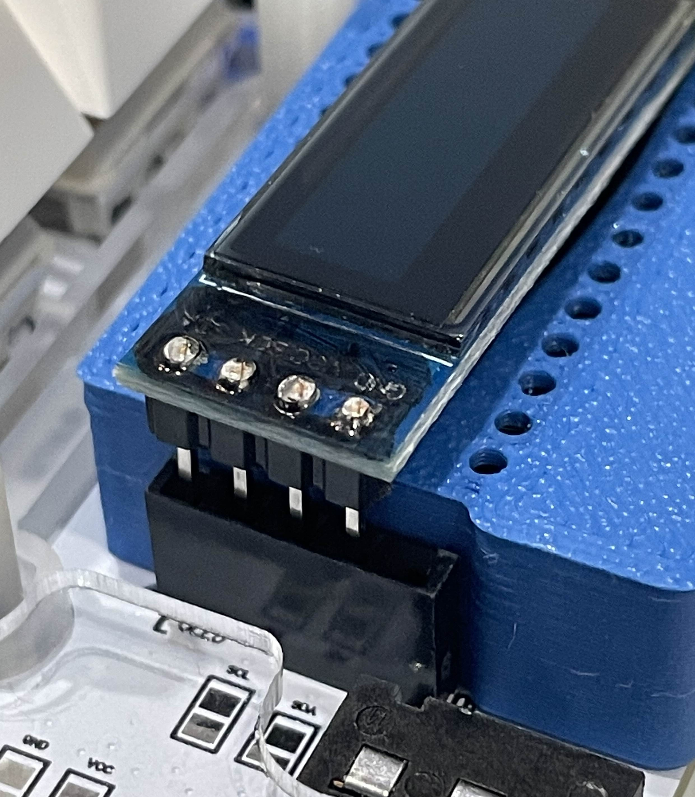  

11. **Left Half Jumpers and Wire Color Order**  
   - JST connectors on batteries have no standard color order unfortunately.  
   - Therefore I have put in place jumpers in case the wire color order is switched.  
   - This is how the jumpers should be placed on the left half in accordance with the wire colors.  
   - 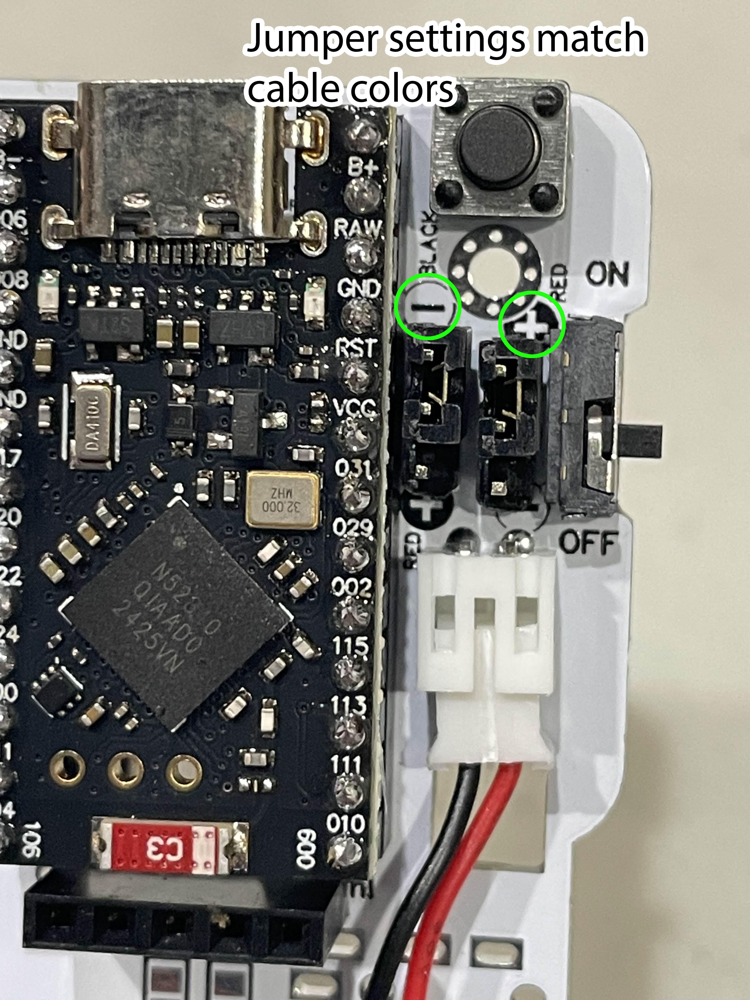  

12. **Right Half Jumpers and Wire Color Order**  
   - This is how the jumpers should be placed on the right half in accordance with the wire colors.  
   -   

---

## 🔋 Charging

- Each keyboard half must be charged separately with the power switch set to “ON”.  
- A blue light indicates charging and will turn off once fully charged.  
- Please avoid using fast-charging adapters or power banks — a regular 5V charger is recommended.  
- Note: Plugging into a computer will also enable wired connection and charge the keyboard if the switch is ON.  

---

## 🛠 Troubleshooting

- If either half becomes unsynced with the dongle, simply press the reset button on each device.  
- This will usually restore the connection.  
- For more technical details, refer to the ZMK firmware documentation.  

---